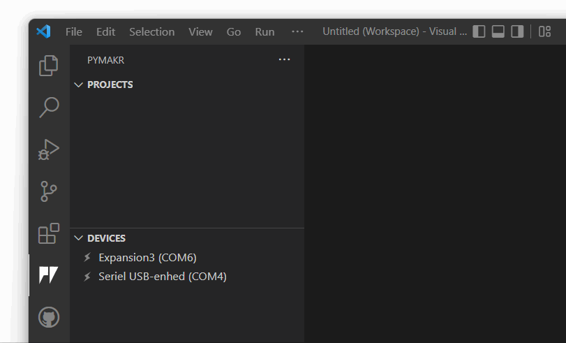
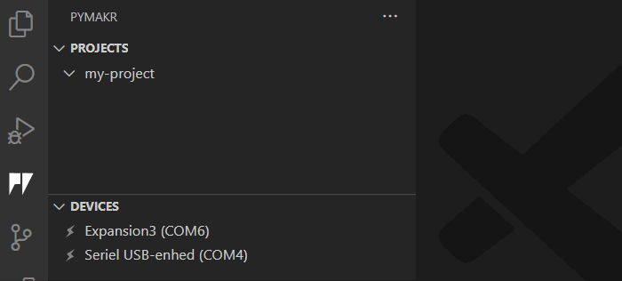
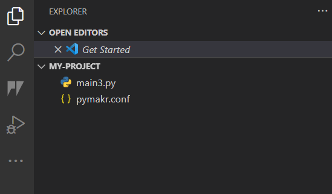

# Getting Started

1. First [download and install Visual Studio Code](https://code.visualstudio.com/).
2. Install the [Pymakr VSCode Extension](https://marketplace.visualstudio.com/items?itemName=pycom.Pymakr)
    
    _(We're installing the preview, but once the project reaches "stable" we'll, be using the regular extension.)_

    

3. That's it! You've installed the Pymakr Extension for VSCode

## Creating a project

Pymakr revolves around projects that can be uploaded to your devices. To create your first project click the `+` icon and select a folder for your project:

_Note: If a project is created outside the current workspace(s), its folder will be mounted as a new workspace._

## Creating a script

Below we add a `main.py`. This file will run whenever the device is reset.

## Upload the project to a device

Once the project is ready to run, it needs to be uploaded to a device.

---

## Hint: Organizing your setup

Having to switch between different tabs can be cumbersome. To solve this, you can drag your devices and projects to the file explorer view.

