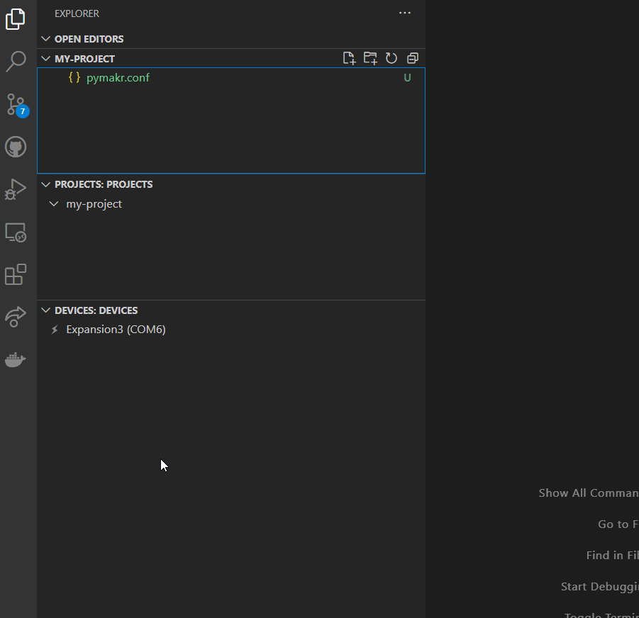
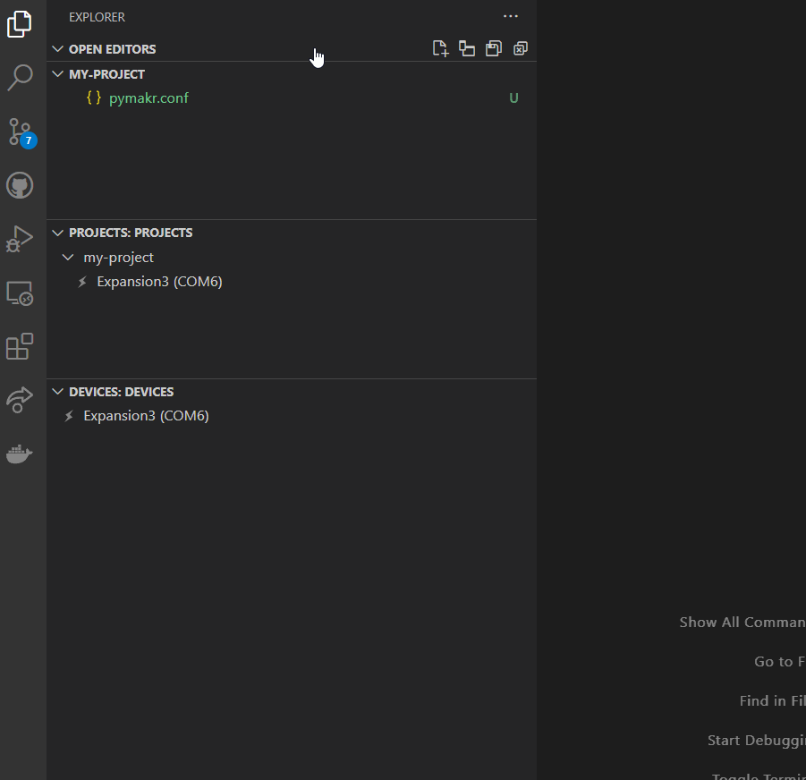

# Pymakr 2 - Preview

### This is an alpha preview of the upcoming Pymakr 2

Please make sure to backup any projects that you use with this extension!

---

### Create a new project

### Move PyMakr to the explorer tab

If you prefer to keep your Pymakr projects and devices next to your file explorer, you can move them to them to the file explorer tab.

### Add a device to a project

Linking devices to projects can speed up development when working on multiple projects and devices.

### Connect a device

Before we can use a device, we need to connect it.

### Add a device to the file explorer

To access our devices directly, we can add it to the file explorer. From here we can create/edit/delete files and folders.

