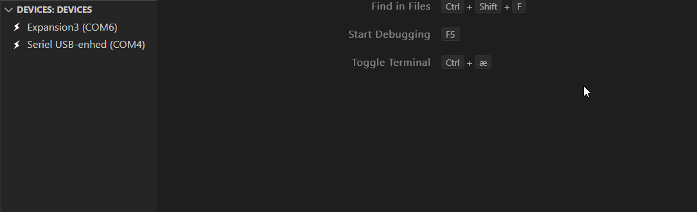
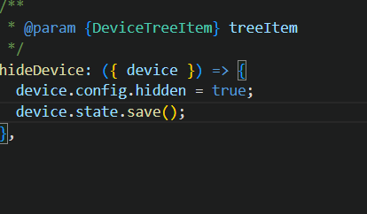

# What's new in Pymakr 2

### New design

Pymakr has gotten its own extension tab. Here projects and devices can be accessed.

It's possible to drag these two views to the explorer tab for better accessibility (please see [Move PyMakr to the explorer tab](./GET_STARTED.md#move-pymakr-to-the-explorer-tab)).

These views can be reorganized for improved accessibility.

Reorganizing views

### Multiple connected devices

Multiple devices can now be connected at the same time.

### Shared terminals for the same device (experimental)

If multiple terminals are open for the same device, the last terminal to receive input will receive the device output. This is useful when handling large amounts of output.

### Projects

Project management is finally here and among the highlights are:

- Multiple workspaces support
- Multiple projects in one workspace
- Auto detection of projects
- Multiple devices per project

### Device File explorer

Mount your device inside VSCode and access it like a USB storage device. You can even save files directly to the device.

### Codebase (for contributors)
Pymakr 2 was written completely from scratch and the codebase is now fully typed JS. On top of that we now have unit and integration tests.

