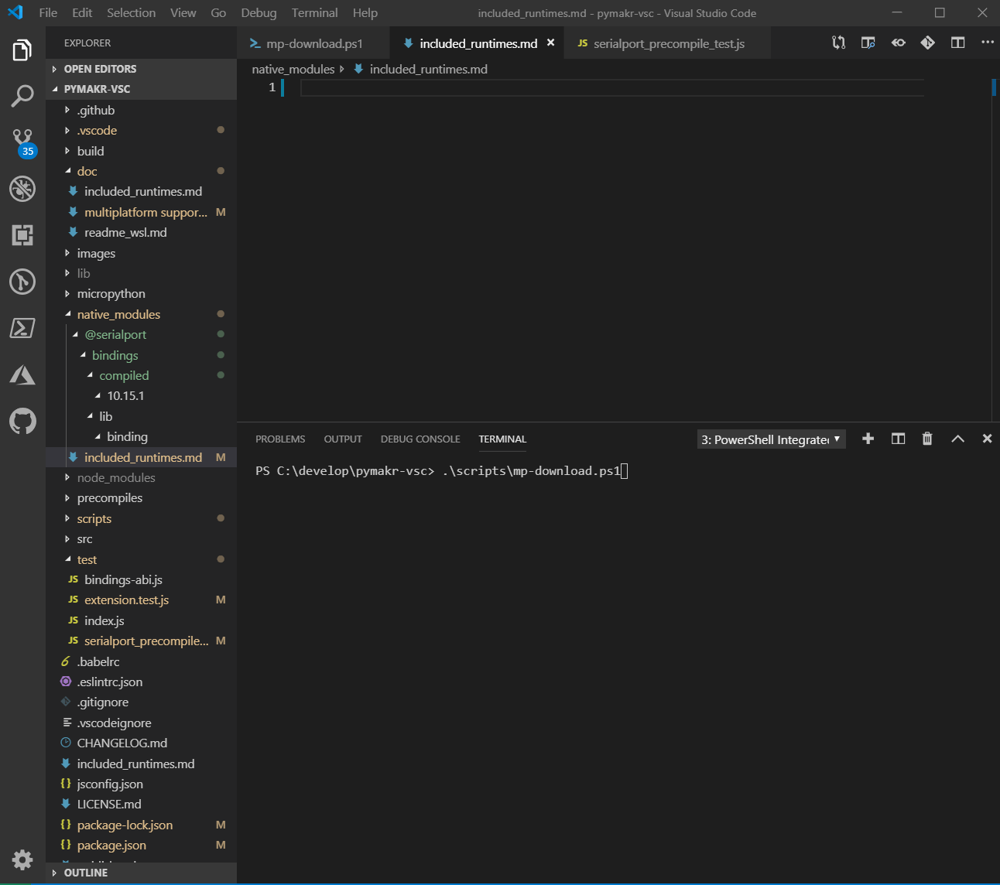

# Multiplatform support 

Pymakr makes use of an Electron/NodeJS module to connect via the serial port to the boards running MicroPython.
one of the challenges of the `serialport` module is that it requires a different implementation of different operating systems, versions of these OSs and different CPU architectures. 
This is implemented by using so called 'native bindings' for these. The bindings are usually written in C or C++ and need to be compiled on,or for, each platform specifically.

There are different implementation standards to implement the interface between the native c/c++ module and the NodeJS or Electron runtime. 
The `serialport` module uses an ABI based interface to implement the low-level interface, and uses the ('bindings')[https://github.com/TooTallNate/node-bindings]  module to locate and load the `@serialport\bindings` sub-module  

While the ABI interface does not change for each version of electron/node, it does change over time , and the bad news is that is it not backward compatible.
So over time , as VSCode is updates and moves to a newer version of electron, at some point in time the required ABI version will change, and unless a *correct* binding is available, pymakr will not be able to communicate to the serial port.store functionality
Over the last year this has occurred several times, and each time it required considerable time and manual effort to restore functionality.


**Current State:**  

Overall  | [](https://dev.azure.com/josverl/JosVerlinde/_build/latest?definitionId=3&branchName=fix/SerialMultiPlatform)
---------|----------
Linux   | [](https://dev.azure.com/josverl/JosVerlinde/_build/latest?definitionId=3&branchName=fix/SerialMultiPlatform) 
Mac     | [](https://dev.azure.com/josverl/JosVerlinde/_build/latest?definitionId=3&branchName=fix/SerialMultiPlatform)
Win     | [](https://dev.azure.com/josverl/JosVerlinde/_build/latest?definitionId=3&branchName=fix/SerialMultiPlatform) 


## Solution: Include native modules for multiple platforms, and future versions 

The implemented solution :
- Update the `bindings` module to version 1.5.0 (or newer)
- Use the `prebuild-install` module to download the native modules that are built and published by the authors of the serialport module
- determine the current and future electron versions used by VSCode
- for each of these versions
    - determine the Application Binary Interface level (ABI) 
    - download the available prebuild native 'bindings' for the relevant and available platforms and architectures
    - store them in the correct structure location in a `native_modules` folder,  parallel to the `nodes_modules` folder
    - copy `native_modules` folder to the `nodes_modules` folder so that `bindings` can load them 
- remove/simplify the current complex re-compilation and re-try logic during install and use 

## mp-download.ps1
As the downloading and placement of the native modules is a precise but cumbersome task, i have automated so that in the majority of cases you only have to run: 
```@Powershell 
.\scripts\mp-download.ps1 -Clean
```


Result:
=======
This wil result in : 
* the download of the download to support 5 different versions of VSCode,
* On 3 platforms across  2 processor architectures.
* Also support for todays's insider version of VSCode, and previous version is included.
* Support for local testing and debugging with the local NodeJS version 
* In this case this includes 20 Native Modules (approx. 3MB) 
* the native modules can be transparently checked in to Source Control,
* After the solution packaged, it is ready for use. no local compilation is required by the end users in order to use the serialport, 

#### Packaging and Release  
Packaging  for multiple platforms and multiple past and future version of VSCode now can be as simple as :

1. download/refresh the binary bindings
    * `.\scripts\mp-download.ps1`
2. clean node_modules 
    * `npm ci`
3. Optional : [remove/ignore the dev-dependencies from node_modules]  
    * `npm prune --production`
4. copy the binary bindings into the node_modules folder] 
    * `copy native_modules node_modules /s`
5. Package 
    * `vsce package`
6. Publish 
    * `vsce Publish`


#### parameters relevant to determining the correct binding

what        | description                   | example                           |
------------|-------------------------------|-----------------------------------|
VSCode      | vscode version                | 1.31.1
module      | module or submodule name      | `@serialport/bindings`            | 
runtime     | application type              | node, electron                    |
platform    | OS type                       | win32, linux, darwin (a.k.a. mac) |
ABI         | Application Binary Interface  | 64, 69, 70                        |
architecture| CPU type                      | x64 , ia64                        |
clib        | platform specific library     | not currently implemented         | 

#### Script to download the native modules : /scripts/get-helmp-download.ps1


additional parameters are : 

```@powershell
param (
    ## project root path
    [string]$root_folder = $PWD,
    #the versions of vscode to support; Defaults to 'master'
    [string[]]$VSCodeVersions = @('master'),
    #the base Electron versions to get natives for 
    [string[]]$ElectronVersions = @() ,
    #the base Node version(s) to get natives form 
    [string[]]$NodeVersions = @() ,
    ## the platforms 
    [string[]]$platforms = @("win32","darwin","linux") ,
    #the processor architectures 
    [string[]]$architectures = @("x64","ia32"),
    ## clean native_modules folder 
    [switch] $Clean,
    ## do not copy,
    [switch] $NoCopy,
    #do not detect the version of node running on this workstation
    [switch] $IgnoreNodeVersion
)
```

Most times you will not need to specify these, as in the majority of cases it is able to read the required information from :
- package.json , the target version of VSCode 
- the VSCode repo on github 
    - The 3 most recent VSCode versions (Major.Minor.*)  
    - The electron versions used by each version of VSCode 
- node-abi to determine the ABI version of a specific native module
- built in defaults for the remaining parameters 
    - VSCode Versions ( from package.json and the VSCode Repo )
    - Electron Versions ( determined by VSCode requirement)
    - Node Versions (from the installed NodeJS Version)
    - The module name ( '@serialport/bindings')
- Hardcoded 
    - the name of the folder : 'native_modules' )
    - the number of recent VSCode versions to support : 3 

It requires the following NodeJS modules to be installed :
- Installed dependencies:
    - `npm install @serialport --save`
    - `npm install node-abi --save`
    - `npm install node-abi@1.5.0 --save`
- Dev dependencies:
    - `npm install prebuild-install --save-dev`

Note: As the module is written in PowerShell it also requires PowerShell Core to be installed.
This is ensure by adding the npm package : `pwsh` as a dev-dependency

#### bindings module - v1.5.0 or newer 
The bindings module is used by the serialport module. from version 1.5.0 (Feb 2019) and newer, it supports  to locate and load modules based on a pattern that includes the ABI, which allows us to package for future updates , without the need to include binaries for each and every possible minor version of electron. 

version 1.5.0 uses the storage pattern used by node-pre-gyp and is in the format of 
    `<native-module>/lib/binding/{runtime}-v{abi}-{platform}-{arch}`

    so for the @serialport/bindings sub-module on x64 windows running node 10.15.1 the path will be:  
        `<project>\node_modules\@serialport\bindings\lib\binding\node-v64-win32-x64\bindings.node` 

    while on ubuntu x64 with node v10.16.0 the path will be:   
        `<project>/node_modules/@serialport/bindings/lib/binding/node-v64-linux-x64/bindings.node`
    Note that the different versions of node do use the same ABI (v64)

In order to make sure a good version of the bindings module is used, you mustupgrade it to at least 1.5.0 by running:  
`npm install bindings@1.5.0 --save` or `npm install bindings@latest --save`

_Note 1:_  
It is not needed to load serialport any differently. `require('serialport')`
It already uses `require('bindings')('@serialport/bindings')` internally to load the native sub-module

_Note 2:_  
`bindings` loads the native modules  from the __node_modules__ folder , not from the __native_modules__ folder.
the __native_modules__ folder is used to allow the files to be checked in, and optionally to store native modules for other platforms or architectures 


#### runtime is hardcoded in bindings module.
_However_, there is one remaining challenge; the `bindings` module (v1.5.0) does not determine the runtime ( i.e. electron or node ), but is hardcoded  to specify the runtime as 'node'
that means that there is a possible collision where node and electron bindings may need to be stored in the same location.

as the same ABI is used by 'node'  and 'electron' bindings but the binary files are different and incompatible, there is a need  avoid collision by using 2 different storage patterns 
- store precompiled *electron*  bindings using the *'node-pre-gyp'* pattern 
- store precompiled *node* bindings using the *'version pattern'*

Note that there are MANY more node versions than ABI versions :-( 
see: https://nodejs.org/en/download/releases/

#### file structure

For electron / node-pre-gyp the folder naming convention is:  
-  `<native-module>/lib/binding/node-v{abi}-{platform}-{arch}`

For node the folder naming convention is:  
- `<native-module>/compiled/{version}/{platform}/{arch}/binding.node`

Each folder contains one file named `bindings.node` which is compiled for that platform.

The files are stored in a `native_modules` folder to allow them to be checked in to source control
in addition the files are also copied to the node_modules folder by the .ps1 script unless  `-nocopy` is specified 

The resulting folder structure is :
```
 <root>/native_modules/@serialport/bindings
                                          +---lib
                                          |   \---binding                         (contains the electron bindings per ABI )
                                          |       +---node-v64-darwin-x64
                                          |       +---node-v64-linux-ia32
                                          |       +---node-v64-linux-x64
                                          |       +---node-v64-win32-ia32
                                          |       +---node-v64-win32-x64
                                          |       +---node-v69-darwin-x64
                                          |       +---node-v69-linux-ia32
                                          |       +---node-v69-linux-x64
                                          |       +---node-v69-win32-ia32
                                          |       \---node-v69-win32-x64
                                          +---compiled                            (contains the node bindings, per version)
                                              \---10.15.1
                                                  +---darwin
                                                  |   \---x64
                                                  +---linux
                                                  |   +---ia32
                                                  |   \---x64
                                                  \---win32
                                                      +---ia32
                                                      \---x64
``` 

## PowerShell core 6
The script has been written in PowerShell 6 core, which allows it to run on the majority of relevant platforms.
While the same logic could be implemented in a NodeJS module, while testing and prototyping, I personally found it simpler and quicker to write the logic in PowerShell.
Also the script only needs to be run on a developer workstation

As the module is written in PowerShell it requires PowerShell Core (pwsh) to be installed.
This is ensured by adding the NPM package : `pwsh` as a dev-dependency: [see on NPM](https://www.npmjs.com/package/pwsh)  
This will automatically take care of the installation.

This allows the script to be uses just as any other NPM script by adding it to the script section of package.json
``` json  
  "scripts": {
    // ...
    "get-binaries": "pwsh --noprofile scripts/mp-download.ps1",
  }

If you prefer to install it manually that can also be ne:
please 
- [Windows](https://docs.microsoft.com/en-us/powershell/scripting/install/installing-powershell-core-on-windows?view=powershell-6)
- [MacOS](https://docs.microsoft.com/en-us/powershell/scripting/install/installing-powershell-core-on-macos?view=powershell-6)
- [Linux](https://docs.microsoft.com/en-us/powershell/scripting/install/installing-powershell-core-on-linux?view=powershell-6)


#### Packaging 

- download/refresh the binary bindings
    * `.\scripts\mp-download.ps1`
    * [additional platforms]
        - (cross) compile 
        - only store in native_modules

- clean node_modules 
    * `npm ci`
        - postinstall will automatically copy the native_modules
- [remove/ignore the dev-dependencies from node_modules]  
    * `npm prune --production`
- copy the binary bindings into the node_modules folder] 
    * copy native_modules node_modules /s 
- Package 
    * `vsce package`


#### References 

* Electron - Using Native Node Modules
https://github.com/electron/electron/blob/master/docs/tutorial/using-native-node-modules.md
https://github.com/Microsoft/vscode/issues/658


## TODO /  actions
- Manual TEST IN ELECTRON 
  - [x] win32-x64 
  - [x] ubuntu-x64 
  - [ ] mac 
  - [ ] others
- Manual TEST in VSCode Insider  or another version with a different ABI (ie vscode 1.31.1 )
  - [ ] win32-x64 
  - [ ] ubuntu-x64 
  - [ ] mac 
  - [ ] others

- [x] cleanup mp-download script 
    - [x] documentation on structure 
    - [x] remove unneeded structure 
    - [x] get & add electron version for given VSCode versions 
    - [x] get & add installed node version to allow simpler debugging / testing (replace current hardcoded version)
    - [x] Save native modules to project folder (native_modules) to (better) allow check-in & avoid permanent removal by `npm ci`
    - [x] add documentation to how to install pwsh on linux / mac
    - [x] make sure mp-download.ps1 runs (on PowerShell core ) 
        - [x] on windows 
        - [x] on linux 
        - [ ] on mac
        - [ ] others
    - [x] merge copy script / download script  ( -onlyCopy )
    [ ] deal with updates to node-abi to properly detect newer version 
            `npm install node-abi@latest`
    [ ] optionally include/hardcode known/next (ABI) versions of electron ?

- [ ] pymakr
    - [ ] simplify serialport loading and errorhandling 
    - [ ] add logic ( code / npm script) to compile on demand ?

- [ ] ask for upstream fix (bindings) on hardcoded runtime (how to detect runtime electron/node ?) 

- [ ]project build 
    - [x] Add MP-download.ps1 as a npm script.
       
    - [ ] PowerShell core is a MANUAL prerequisite - ( dev dependcy creates issues on azure pipeline )
            this includes adding powershell core as a dev dependency [pwsh](https://www.npmjs.com/package/pwsh)
            which takes care of the installation of powershell core.

    - [x] copy native_modules as a post-install task
            ``` json
              "scripts": {
                            "postinstall": "pwsh --noprofile scripts/copy-native.ps1",
                            "get-binaries": "pwsh --noprofile scripts/mp-download.ps1",
                        }
            ```
    - [x] prevent packaging of  pwsh dev-dependency by explicit exclude in `.vscodeignore`

    - [x] remove dev-dependencies before packaging `npm ci` & `npm prune --production`

- [ ]  Add automated tests for loading serialport
  - [ ] build pipeline in Azure Devops / Azure Pipelines
        - [x] linux 
        - [x] windows
        - [x] mac
    - [x] create test in mocha/chai 
        - [/] in NODE (partial) 
        - [ ] export test results in re-usable format to Azure Pipelines 
        - [ ] report / alert on failed tests 

    - [ ] vscode spectron tests 
        - [ ] in electron with same build as VSCode current / future 
    - [ ] run automated tests against insiders version 

- [x] integrate into / replace install.js 
    - [x] re-Test with //empty `install.js`  
    - [?] call PS1 script from install.js (https://github.com/IonicaBizau/powershell)

- [ ] strech goals 
        - [?] only trigger rebuild when serialport cannot be loaded  ( Arch Linux) 
        - [?] translate PS1 script into javascript ? ( lots of effort )
        - [ ]  add doc how to include build & add additional native modules ( arch linux ...) 


